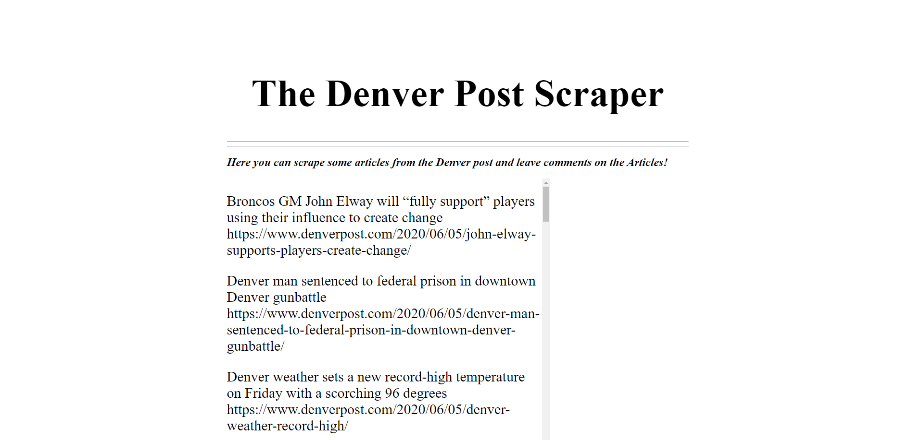
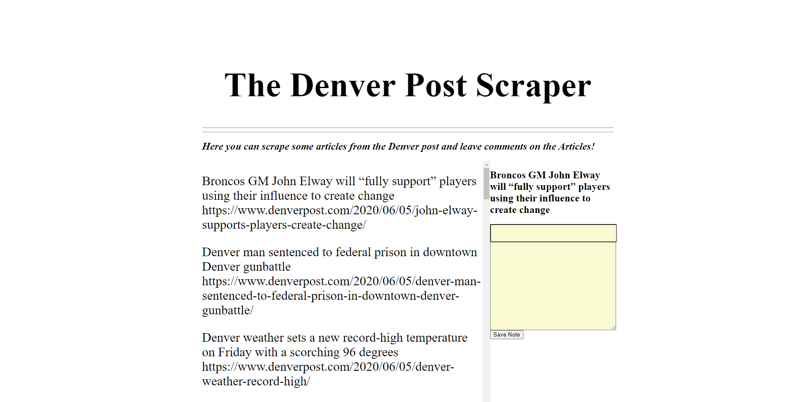

# DenverPostScraper
To get this to work, you will need to install these npm packages:
# npm i axios
# npm i cheerio
# npm i express
# npm i mongoos

# Here you able to scrape all of the recent news from the Denver Post!

# 2- If you find one interesting you are able to take a note of it and look at it later!

